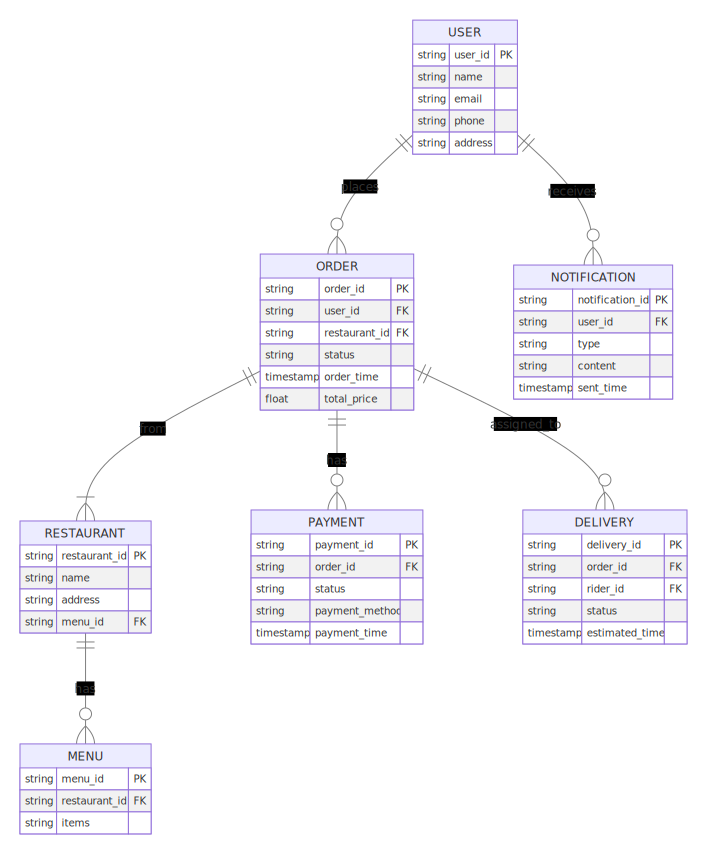
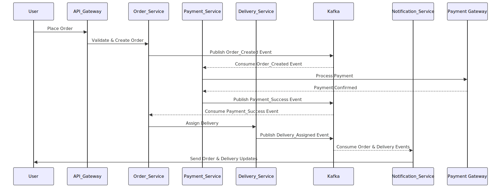
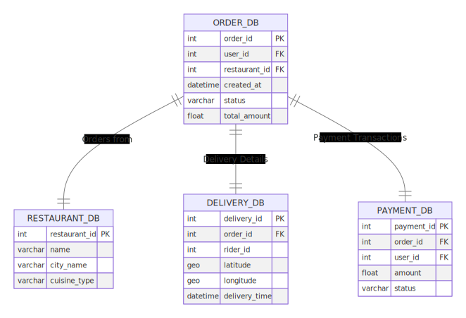
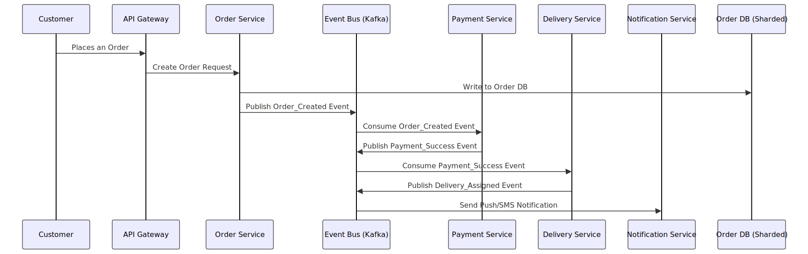
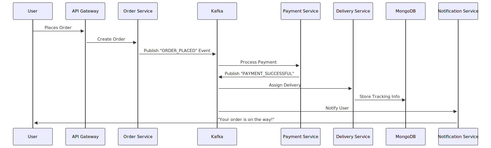

# PIZZA DELIVARY SYSTEM (GLOBAL SYSTEM)

## **1. API Gateway & Load Balancer**

- **API Gateway (Kong / AWS API Gateway / Nginx)**
  - Handles authentication, rate limiting, request routing, and caching.
- **Global Load Balancer (AWS ALB / GCP Load Balancer)**
  - Distributes traffic across multiple regional instances.

---

## **2. Frontend Clients**

- **Mobile App (React Native / Flutter)**
- **Web App (React / Angular)**
- **Admin Dashboard (React / Angular)**
- **Third-Party API Clients (Partner Integration for Orders)**

---

## **3. Core Microservices**

### **User & Authentication**

- **User Service** (Manages user profiles, authentication, and authorization)
  - **Auth0 / Firebase Auth / AWS Cognito**
  - PostgreSQL for user data storage.
  - JWT / OAuth2 for authentication.

### **Order Management**

- **Order Service** (Handles order creation, updates, and tracking)
  - PostgreSQL (ACID compliance for transactions).
  - Uses Kafka for event-driven updates.

### **Payment Processing**

- **Payment Service** (Handles transactions, refunds, and fraud detection)
  - Integrates **Stripe, PayPal, Razorpay, UPI**.
  - Ensures compliance with **PCI DSS**.
  - Uses **Kafka** for asynchronous order updates.

### **Restaurant & Menu Management**

- **Restaurant Service** (Stores restaurant details and menus)
  - DynamoDB / MongoDB for fast access.
  - Elasticsearch for search functionality.

### **Kitchen & Order Fulfillment**

- **Kitchen Service** (Manages order preparation, estimated time, and workflow)
  - Uses WebSockets for real-time order status updates.

### **Delivery & Rider Management**

- **Delivery Service** (Manages riders and order tracking)
  - Uses **Firebase Firestore / MongoDB** for real-time updates.
  - WebSockets / gRPC for real-time communication.

### **Notification & Customer Engagement**

- **Notification Service** (Sends push, SMS, email notifications)
  - Uses **Twilio, Firebase Push, SendGrid**.

### **Review & Feedback**

- **Review Service** (Manages customer ratings and reviews)
  - Uses PostgreSQL or DynamoDB.

### **Search & Recommendation**

- **Search Service** (Helps users find restaurants and dishes)
  - **Elasticsearch** for full-text search.
  - **Redis / Memcached** for caching.

### **Loyalty & Rewards**

- **Loyalty Service** (Handles discounts, coupons, and rewards)
  - PostgreSQL / DynamoDB for storage.

### **Customer Support**

- **Support Service** (Chatbots, helpdesk, and complaint resolution)
  - Uses **Zendesk / ChatGPT API**.

---

## **4. Backend Infrastructure**

### **Database & Storage**

- **PostgreSQL / MySQL** (For transactional data: orders, users, payments)
- **DynamoDB / Cassandra** (For restaurant data, menu caching)
- **MongoDB / Firestore** (For real-time delivery tracking)
- **Elasticsearch** (For fast search queries)
- **Redis / Memcached** (For caching frequently accessed data)
- **BigQuery / Snowflake** (For analytics & reporting)

### **Event-Driven Architecture**

- **Apache Kafka / RabbitMQ** (For asynchronous communication)
  - Order events, payment processing, restaurant updates.

### **Distributed Transaction Management**

- **Saga Pattern (Camunda / Temporal / Orchestration Engine)**

### **Caching & Performance Optimization**

- **Redis / Memcached** (Reduces DB load)
- **CDN (Cloudflare / AWS CloudFront)** (For static assets)

### **Rate Limiting & Security**

- **API Gateway Throttling**
- **DDoS Protection (Cloudflare / AWS Shield)**
- **Data Encryption (AES-256, TLS 1.2/1.3)**

---

## **5. DevOps & Deployment**

### **Containerization & Orchestration**

- **Kubernetes (K8s) / Docker** (Manages microservices)
- **Helm Charts** (For Kubernetes deployment)

### **Continuous Integration & Deployment (CI/CD)**

- **GitHub Actions / Jenkins / ArgoCD** (Automates deployments)

### **Logging & Monitoring**

- **Prometheus & Grafana** (Metrics collection & visualization)
- **ELK Stack (Elasticsearch, Logstash, Kibana)** (Log analysis)
- **Jaeger / OpenTelemetry** (Distributed tracing)

---

## **6. Third-Party Integrations**

- **Payment Gateways:** Stripe, PayPal, Razorpay, UPI.
- **SMS & Email Notifications:** Twilio, SendGrid.
- **Geo Services:** Google Maps API, OpenStreetMap.
- **Analytics & Reporting:** Snowflake, AWS QuickSight.

---

### **Final Architecture Categories**

✅ **Frontend Clients** – Apps, Website, Dashboard  
✅ **Core Microservices** – Orders, Payments, Users, etc.  
✅ **Infrastructure** – Database, Messaging, API Gateway  
✅ **DevOps & Monitoring** – CI/CD, Logging, Kubernetes  
✅ **Third-Party Integrations** – Payment, Maps, Notifications

### **Indexing & Sharding Strategy for the Global Pizza Delivery System**

When designing a **global-scale pizza delivery system**, handling **high query loads, low-latency search, and massive datasets** is crucial. Below, I'll cover **indexing, sharding, partitioning, replication, and why specific choices are made**.

---

## **1️⃣ Indexing Strategy**

Indexing helps in **fast lookups** for frequently accessed data. Let's break it down by service.

### **📌 Order Service (PostgreSQL)**

- **Indexes**:

  - **B-Tree Index** on `order_id` (Primary Key) – Faster lookups.
  - **Hash Index** on `user_id` – Efficient filtering by user.
  - **GIN Index** on `status` – Fast lookups for `Pending`, `Completed`, etc.
  - **Partial Index** on `created_at` for last `7 days` – Optimized queries.

- **Why B-Tree?** PostgreSQL defaults to **B-Tree** because it works well for **range queries** (`BETWEEN`, `<`, `>`).
- **Why Hash Index?** Hash indexes are efficient for **exact match lookups**, such as finding all orders by a `user_id`.

### **📌 Restaurant & Menu Service (DynamoDB)**

- **Indexes**:

  - **Partition Key** → `restaurant_id`
  - **Global Secondary Index (GSI)** on `city_name`
  - **Local Secondary Index (LSI)** on `cuisine_type`
  - **Elasticsearch Sync for Full-Text Search on Menus**

- **Why GSI & LSI?**
  - **GSI** allows querying restaurants by `city_name`, helpful for geo-based lookups.
  - **LSI** allows efficient filtering by `cuisine_type` within a restaurant.
  - **Elasticsearch** enhances **fuzzy search** for menu items like `"Cheese Pizza" ~ "Cheesy Pizza"`.

### **📌 Delivery Service (MongoDB)**

- **Indexes**:

  - **2D GeoSpatial Index** on `(latitude, longitude)`
  - **Compound Index** on `rider_id, status`
  - **TTL Index** on `delivery_time` (Expire after 24 hours)

- **Why GeoSpatial Index?**
  - Helps find **nearest delivery agents** within a given radius.
  - Enables **fast searches based on real-time location updates**.
- **Why TTL Index?**
  - Automatically deletes old records to **keep DB size manageable**.

---

## **2️⃣ Sharding Strategy**

Sharding ensures the system can handle **millions of queries per second**. Here’s how we’ll distribute data.

### **📌 Order Service (PostgreSQL)**

- **Sharded by `user_id` (Range-Based Sharding)**

  - Each shard contains **orders of a range of users** (`1-10M`, `10M-20M`).
  - Reduces **hotspotting** since users place orders across different shards.
  - **Replication per region** for **fault tolerance**.

- **Alternative: Hash-Based Sharding**
  - **Pro:** Uniform distribution of load.
  - **Con:** Can’t efficiently query **"all orders of a city"**.

### **📌 Restaurant & Menu Service (DynamoDB)**

- **Sharded by `restaurant_id` (Partition Key)**

  - **Each restaurant has its menu data** stored separately.
  - **GSI on `city_name`** ensures we can query "restaurants in a city".
  - **Read replicas** in **multiple regions** ensure **faster local access**.

- **Why Not Range-Based?**
  - Restaurant names aren't **evenly distributed** (e.g., many start with "Pizza").
  - **Hashing avoids hotspots** in a distributed database.

### **📌 Delivery Service (MongoDB)**

- **Sharded by `city_name` (Geo-Sharding)**

  - Each **city has its delivery tracking database**.
  - Within each city, **GeoSpatial indexing** helps find riders.

- **Why Not Hash-Based?**
  - **Location-based lookups** would be inefficient.
  - **GeoPartitioning keeps data close to riders** and improves **real-time updates**.

---

## **3️⃣ Partitioning & Replication Strategy**

Partitioning splits large tables into smaller **manageable units**.

### **📌 Order Service (PostgreSQL)**

- **Time-Based Partitioning** (`Monthly`)

  - Orders older than **6 months** move to **cold storage (S3, Glacier)**.
  - Speeds up recent order lookups.

- **Read Replicas per Continent**
  - US, EU, Asia each have a **read-only replica** to **reduce query latency**.

### **📌 Restaurant Service (DynamoDB)**

- **Partitioned by Region**
  - US-East, US-West, Europe, Asia.
  - **Multi-active replication** ensures **restaurants can update data from any location**.

### **📌 Delivery Service (MongoDB)**

- **GeoPartitioned & Read-Replicated**
  - India’s deliveries stay in India, US in US.
  - **Read-optimized replicas for mobile clients**.

---

## **4️⃣ Caching Strategy**

We need **caching** to avoid **hitting the database too often**.

| Service               | Cache Strategy                | Why?                                   |
| --------------------- | ----------------------------- | -------------------------------------- |
| **Order Service**     | Redis (LRU) for recent orders | Users check recent orders often        |
| **Restaurant Menu**   | Redis / Memcached             | Speeds up restaurant & menu queries    |
| **Delivery Tracking** | In-Memory Cache (10s TTL)     | Reduces DB calls for real-time updates |
| **Search & Filters**  | Elasticsearch                 | Full-text search for restaurant names  |

---

## **5️⃣ Load Balancing & API Gateway**

To handle **millions of requests per second**, we use:

| Component        | Load Balancer / Proxy                            |
| ---------------- | ------------------------------------------------ |
| API Gateway      | **Nginx / AWS API Gateway**                      |
| Backend Services | **Kubernetes Ingress + Internal Load Balancers** |
| Caching Layer    | **Redis Cluster Mode**                           |
| Database         | **Read Replicas & Auto-Scaling**                 |

---

## **6️⃣ Deployment & Scaling Strategy**

### **📌 Horizontal Scaling**

- **Kubernetes (K8s) & Auto-Scaling**
- Each service runs **independently in containers**.
- **Event-driven scaling** → Auto-scale when high load detected.

### **📌 Global Deployment**

- **Multi-Region AWS / GCP Setup**
- **Load Balancers** route traffic to nearest server.
- **Edge caching (CDN)** for static assets.

---

### **🛠 Why This Design?**

✅ **Optimized Reads** – Using **indexes, caching, partitioning**.  
✅ **Low Latency** – **Sharding, Replication, CDN, GeoPartitioning**.  
✅ **Scalable** – **Event-Driven, Auto-Scaling, Kubernetes**.  
✅ **Fault-Tolerant** – **Redundant regions, Replication, Kafka**.  
✅ **Real-time Capable** – **GeoSpatial Indexing, WebSockets, Event Bus**.

---

### **1️⃣ Database Indexing Strategy**

---

### **2️⃣ Sharding & Partitioning Strategy**

---

### **3️⃣ Event-Driven Architecture & Replication**

---

### **Why This Design?**

✔ **Indexes** optimize search queries across **PostgreSQL, DynamoDB, MongoDB**.  
✔ **Sharding by User ID, GeoPartitioning, and City-Based Partitions** distribute load.  
✔ **Event-Driven Architecture with Kafka** reduces synchronous calls & improves scalability.  
✔ **Read Replicas in Multiple Regions** reduce database load.

## **Deep Dive into Data Storage & Architecture for a Global Pizza Delivery System** 🍕

A **global-scale pizza delivery system** needs a highly efficient **data architecture** that balances:  
✔ **Scalability** (handling billions of orders)  
✔ **Low Latency** (fast search & tracking)  
✔ **Reliability** (ACID for payments, eventual consistency for tracking)  
✔ **Cost Efficiency** (hot vs. cold storage)

---

# **📌 1. Key Data Entities & Size Estimations**

### **1️⃣ Orders**

- **Contains:** Order details, status, payment, delivery info, tracking, etc.
- **Scale:** 500M+ orders/day → ~1TB/day (~365TB/year)
- **Storage Choice:** **PostgreSQL (Sharded) + Cold Storage (S3/GCS)**
- **Partitioning Strategy:**
  - **Sharded by `user_id`** (even distribution of load)
  - **Partitioned by `created_at`** (for fast retrieval & archival)
- **Indexing:**
  - **B-Tree index on `order_id`, `user_id`** (fast lookup)
  - **GIN index on `status` (JSONB column)** (query orders by status efficiently)
  - **GeoIndex on `delivery_location`** (for nearest driver assignment)

---

### **2️⃣ Users**

- **Contains:** Name, email, phone, preferences, addresses, loyalty points
- **Scale:** 500M users (~1.5TB)
- **Storage Choice:** **PostgreSQL + Redis Cache**
- **Indexing:**
  - **Primary Key: `user_id`**
  - **B-Tree index on `phone_number, email`**
  - **Cache recent lookups in Redis** (low latency reads)

---

### **3️⃣ Restaurants**

- **Contains:** Name, location, cuisine, ratings, menus, operating hours
- **Scale:** 50M restaurants (~250GB)
- **Storage Choice:** **DynamoDB (NoSQL, GSI on `city_name`)**
- **Indexing:**
  - **Partition Key: `restaurant_id`**
  - **Global Secondary Index (GSI) on `city_name`**
  - **Local Secondary Index (LSI) on `cuisine_type`**
- **Replication:** Multi-region to keep search fast worldwide

---

### **4️⃣ Menu**

- **Contains:** Menu items, descriptions, prices, availability
- **Scale:** 5B menu items (~2.5TB)
- **Storage Choice:** **MongoDB (NoSQL, Document DB)**
- **Indexing:**
  - **Index on `restaurant_id` (fast lookups by restaurant)**
  - **Text search indexing for menu search**

---

### **5️⃣ Live Order Tracking**

- **Contains:** Delivery status, driver location, estimated arrival time
- **Scale:** 10M+ concurrent deliveries → **360GB/hour**
- **Storage Choice:** **MongoDB (GeoSharded) + Redis for hot lookups**
- **Indexing:**
  - **GeoIndex on `current_location` (fast lookups by area)**
  - **TTL Index (auto-delete records after 1 hour)**

---

### **6️⃣ Payments**

- **Contains:** Payment transactions, refunds, fraud detection data
- **Scale:** 100M+ transactions/day
- **Storage Choice:** **PostgreSQL (ACID Compliance) + Kafka for async processing**
- **Indexing:**
  - **Primary Key: `transaction_id`**
  - **Index on `user_id`, `order_id`**

---

### **7️⃣ Reviews & Ratings**

- **Contains:** User reviews, restaurant ratings
- **Scale:** 1B+ reviews
- **Storage Choice:** **Elasticsearch (Full-text search) + PostgreSQL**
- **Indexing:**
  - **Full-text search index on `review_text`**
  - **B-Tree index on `restaurant_id`**

---

# **📌 2. Storage Optimization Techniques**

### **🗂️ 1. Sharding Strategy**

- **PostgreSQL (Orders, Users, Payments)**
  - **Horizontal sharding by `user_id`**
  - **Logical partitions on `created_at`**
- **MongoDB (Live Tracking, Menus)**
  - **GeoSharding by `latitude, longitude`**
- **DynamoDB (Restaurants, Menus)**
  - **Partition by `city_name`** (ensures load balancing)

### **🚀 2. Caching Strategy**

- **Redis for user profiles, session management**
- **CDN (Cloudflare/Akamai) for menu images, static assets**
- **Elasticsearch for fast menu & restaurant search**

### **📜 3. Archival & Data Retention**

- **Orders older than 1 year → Cold Storage (S3/GCS)**
- **Live tracking data auto-deleted after 1 hour (TTL Index)**

---

# **📌 3. Event-Driven Architecture (Async Processing)**

To improve **scalability & performance**, use **event-driven architecture** with Kafka.

✅ **Advantages of Kafka-based event processing**:  
✔ **Decoupling Services** (Order, Payment, Delivery work independently)  
✔ **Scalability** (Millions of orders per second)  
✔ **Fault Tolerance** (Kafka retains events for replay)

---

# **📌 4. High-Level System Architecture**

---

# **📌 5. Deployment & Scaling**

### **🛠️ Deployment Model**

- **Multi-region AWS/GCP Deployment** for low latency
- **Microservices in Kubernetes (EKS/GKE)**
- **Auto-scaling with HPA (Horizontal Pod Autoscaler)**
- **Log aggregation with ELK stack**

### **🔧 Load Balancing**

- **Global Load Balancer (Cloudflare, AWS ALB)**
- **Separate read replicas for PostgreSQL**

---

# **✅ Final Thoughts**

### **Key Takeaways**

✔ **Hybrid SQL + NoSQL** for best scalability  
✔ **Sharding & Partitioning** to handle billions of records  
✔ **Kafka-based async processing** for performance  
✔ **GeoIndexing for live tracking**  
✔ **Redis & CDN for ultra-fast access**
